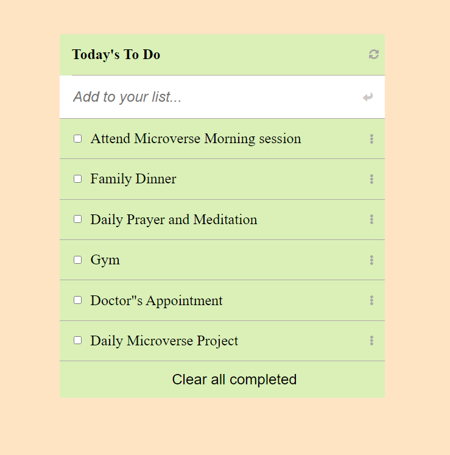

# ToDo List
This "To-do-list" app is a simple web application that displays a list of task and allows you to add and remove task from that list. it is built with the latest technology including but not limited to HTML, CSS, JavaScript and  webpack to manipulate DOM.

## Live Demo (github)

[Todo list](https://jerryowusu.github.io/todo-list/)

## Built With!

- HTML.
- CSS.
- JavaScript.
- Webpack.
- NPM.

## Getting Started

To get a local copy up and running follow these simple example steps.

### Prerequisites

clone repo: https://github.com/jerryowusu/todo-list.git

A Web Browser (preferably Google Chrome)

### Setup

- Clone the GitHub Repository
- Install npm package manager
- npm install webpack-dev-server --save-dev
- npm run build
- npm start

### Usage
Open index.html in Chrome

### Authors

👤 **Author**

- GitHub: [@jerryowusu](https://github.com/jerryowusu)
- Twitter: [@jerryowusu11](https://twitter.com/jerryowusu11)
- LinkedIn: [Jerry Owusu](https://www.linkedin.com/in/jeremiah-owusu-b50a70173/)

## 🤝 Contributing

Contributions, issues, and feature requests are welcome!

Feel free to check the [issues page](https://github.com/jerryowusu/todo-list/issues)

## Show your support

Give a star ⭐️ if you like this project!

## 📝 License

This project is [MIT](LICENSE) licensed
